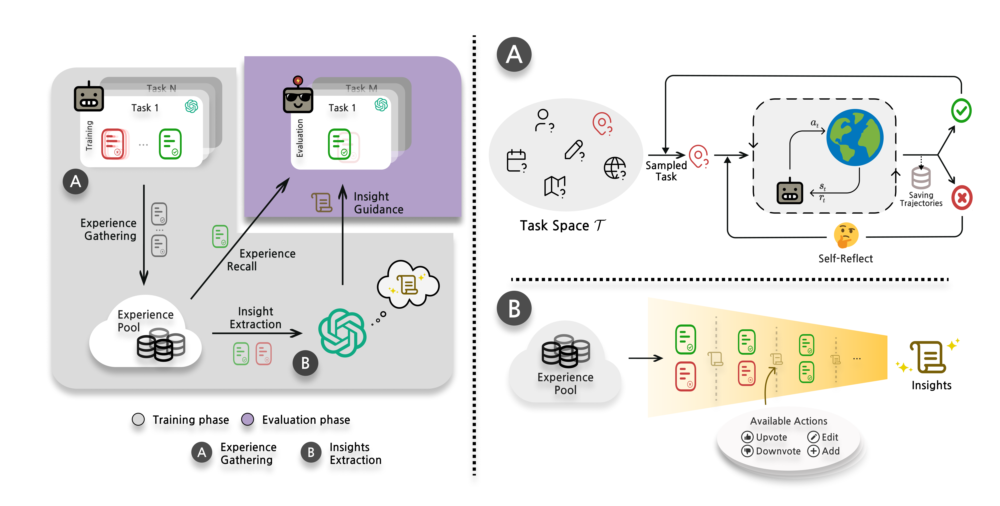

  | <span style="font-size: 25px;">ExpeL: LLM Agents are Experiential Learners</span>
:---:|:---:


⚡ [AAAI 2024 *(Oral)*] Official implementation of the ExpeL Agent ⚡

~ by Andrew Zhao, Daniel Huang, Quentin Xu, Matthieu Lin, Yong-Jin Liu, Gao Huang ~


[](https://github.com/LeapLabTHU/ExpeL/releases)

[](https://star-history.com/#LeapLabTHU/ExpeL)
[](https://github.com/LeapLabTHU/ExpeL/issues)

---
### 🌐 $\cdot$ [Project Page](https://andrewzh112.github.io/#expel) &ensp; 📄 $\cdot$ [Paper](https://arxiv.org/pdf/2308.10144.pdf)

> "A computer program is said to learn from experience E with respect to some class of tasks T and performance measure P, if its performance at tasks in T, as measured by P, improves with experience E." - Tom Mitchell

# 📖 Table of Contents

<div style="display: flex;">

  <!-- Left Column - List -->
  <div style="flex: 1; padding-right: 1px;">

[👋 Introduction](#-introduction)

[🛠️ Installation](#-installation)

- [🌳 Environments](#-environments)
  - [🏠 ALFWorld](#-alfworld)
  - [🛒 Webshop](#-webshop)

[🚀 Quick start](#-quick-start)
1. [Experience Gathering](#1-for-the-experience-gathering-stage)
2. [Insights Extraction](#2-for-the-insights-extraction-stage)
3. [Evaluation](#3-for-evaluation)

[🫡 Cite us !](#-cite-us-)

[💌 Contact us !](#-contact-us-)

[🏛️ License](#-license)

[⚠️ Issues](#-issues)

  </div>

  <!-- Right Column - Image -->
  <div style="flex: 2;">
  
  
  
  </div>

</div>


## 👋 Introduction

This repo is the official implementation of [Expel: LLM Agents are Experiential Learners](https://arxiv.org/pdf/2308.10144.pdf). 

Our agent autonomously gathers experiences and extracts knowledge using natural language from a collection of training tasks. At inference, the agent recalls its extracted insights and past experiences to make informed decisions. Our empirical results highlight the robust learning efficacy of the ExpeL agent, indicating a consistent enhancement in its performance as it accumulates experiences.

## 🛠️ Installation
Python version : 3.9.17

1. Create a virtual environment using [Anaconda](https://anaconda.org/anaconda/python) (or your favorite package manager), activate it, clone the repo and install the requirements.

```sh
conda create -n expel python=3.9.17
conda activate expel

git clone https://github.com/LeapLabTHU/ExpeL.git expel
cd expel

pip install -r requirements.txt
```

Next you need to setup the environments.

## 🌳 Environments

Baby ExpeL has been playing around with the following environments: 

- ❓[HotpotQA](https://github.com/hotpotqa/hotpot)
- 🏠 [ALFWorld](https://github.com/alfworld/alfworld)
- 🛒 [Webshop](https://github.com/princeton-nlp/WebShop)
- 🌡️ [FEVER](https://github.com/awslabs/fever)

Among these, ALFWorld and Webshop require manual installation (+ loading a server (can be local) for Webshop). Details below:

### 🏠 ALFWorld
The installation instructions are shown below. Use the previously created environment to install ALFWorld.
You will also need to download the data at the specified location: `data/alfworld`.
```Bash
conda activate expel
pip install alfworld[full]

export ALFWORLD_DATA="data/alfworld"
alfworld-download
```
If you need more details, please refer to the [Official repo](https://github.com/alfworld/alfworld#quickstart).

### 🛒 Webshop

Webshop installation is different from the other environments. You will have to install it and **manually** run the server (can be local) in parallel of ExpeL to interact with the environment.
The succint installation instructions are shown below.

```bash
git clone https://github.com/princeton-nlp/webshop.git webshop
cd webshop

# Create another env for the webshop server to avoid conflicts
conda create -n webshop python=3.8.13 
conda activate webshop

./setup.sh -d all
```

By default the WebShop only loads 1,000 products. But we need <u>ALL OF THEM</u> (🤯). So change web_agent_site/utils.py:

```python
# DEFAULT_ATTR_PATH = join(BASE_DIR, '../data/items_ins_v2_1000.json')
# DEFAULT_FILE_PATH = join(BASE_DIR, '../data/items_shuffle_1000.json')
DEFAULT_ATTR_PATH = join(BASE_DIR, '../data/items_ins_v2.json')
DEFAULT_FILE_PATH = join(BASE_DIR, '../data/items_shuffle.json')
```
To run the server, run the following command:
```bash
./run_dev.sh
```
You will be given an URL (and port) once the website is on:
- Go back to the cloned ExpeL repo
- Modify the config file and add the given URL at envs/webshop/webshop.py:
```python
WEBSHOP_URL = "http://127.0.0.1:3000" # Example URL
```

Note that you will have to run the webshop server in the background to interact with the environment. We gathered some bugs we encountered during the Webshop Server setup [here](#issues).

If you need more details, please refer to the [Official repo](https://github.com/princeton-nlp/WebShop?tab=readme-ov-file#-setup).


## 🚀 Quick start

Below are the commands to run the ExpeL Agent.

**Either put your OpenAI API key in a .env (OPENAI_API_KEY=XXX) file or get prompted in the command line**

### 1. For the **Experience Gathering** stage:
```bash
python train.py benchmark=<benchmark-name> \
  run_name=<train-run-name> \
  testing=false \
  resume=false

# resume = true/false if you want to resume a previous run
# benchmark = {hotpotqa, alfworld, webshop, fever}
# agent.llm = {gpt-3.5-turbo (default), gpt-4}
```
Below are the commands to run the experience gathering stage as in the paper:
```bash
# 🏠 ALFWorld
python train.py benchmark=alfworld run_name=<train-run-name> testing=false resume=false
# 🛒 Webshop
python train.py benchmark=webshop run_name=<train-run-name> testing=false resume=false
# ❓ HotpotQA
python train.py benchmark=hotpotqa run_name=<train-run-name> testing=false resume=false
```

By default, the result files (logs, dictionnaries) will be saved in ``logs/<benchmark-name>/expel`` referenced by ``<train-run-name>``. You can change the log directory by adding ``log_dir=<log-dir>`` to the command line.


### 2. For the **Insights Extraction** stage:
Use the collected experiences to extract insights.

```bash
python insight_extraction.py \
  benchmark=<benchmark-name> \
  load_run_name=<train-run-name> \
  run_name=<insights-extraction-run-name> \ 
  agent.llm=<model> \
  agent.max_num_rules=<insights-num> \
  agent.success_critique_num=<exp-num> \
  testing=true \
  resume=false

# agent.success_critique_num = number of experiences to give per iteration
# agent.max_num_rules = target number of insights to extract
```

To resume a run that stopped at a specific fold, remove ``load_run_name`` from the parameters and specify the fold ``resume_fold`` it stopped at and ``resume=true``.


Below are the commands to run the insights extraction stage as in the paper:
```bash
# 🏠 ALFWorld
python insight_extraction.py benchmark=alfworld load_run_name=<train-run-name> run_name=<insights-extraction-run-name> agent.llm=gpt-4 agent.max_num_rules=10 agent.success_critique_num=8 testing=false resume=false
# 🛒 Webshop
python insight_extraction.py benchmark=webshop load_run_name=<train-run-name> run_name=<insights-extraction-run-name> agent.llm=gpt-4 agent.max_num_rules=8 agent.success_critique_num=4 testing=false resume=false
# ❓ HotpotQA
python insight_extraction.py benchmark=hotpotqa load_run_name=<train-run-name> run_name=<insights-extraction-run-name> agent.llm=gpt-4 agent.max_num_rules=10 agent.success_critique_num=8 testing=false resume=false
```

The final result files will be saved in ``logs/<benchmark-name>/expel/extracted_insights`` referenced by ``<insights-extraction-run-name>``.


### 3. For **Evaluation**:
```bash
python eval.py benchmark=<benchmark-name> \
  load_run_name=extracted_insights/<insights-extraction-run-name> \
  run_name=<eval-run-name> \
  benchmark.eval_configs.k_folds=<fold-num> \
  agent.fewshot_strategy=task_similarity \
  agent.retrieval_kwargs.max_fewshot_tokens= <max-retrieval-token-size> \
  agent.retrieval_kwargs.buffer_retrieve_ratio = <retrieve_multiplier-coefficient> \
  testing=false \
  resume=false

# agent.fewshot_strategy = {task_similarity, thought_similarity,task_thought_similarity)
# agent.llm = {gpt-3.5-turbo (default), gpt-4}
# agent.retrieval_kwargs.max_fewshot_tokens=auto
# benchmark.eval_configs.k_folds=2 
# agent.retrieval_kwargs.buffer_retrieve_ratio = safety measure to not retrieve 0 examples (bigger is safer)
```

To resume a run that stopped, remove ``load_run_name`` from the parameters and add ``resume=true`` at the end of the command line.

Below are the commands to evalute ExpeL as in the paper:

```bash
# 🏠 ALFWorld
python eval.py benchmark=alfworld load_run_name=extracted_insights/<insights-extraction-run-name> run_name=<eval-run-name> agent.fewshot_strategy=task_similarity agent.retrieval_kwargs.max_fewshot_tokens=auto testing=false resume=false
# 🛒 Webshop
python eval.py benchmark=webshop load_run_name=extracted_insights/<insights-extraction-run-name> run_name=<eval-run-name> agent.fewshot_strategy=task_similarity agent.retrieval_kwargs.max_fewshot_tokens=auto agent.retrieval_kwargs.buffer_retrieve_ratio=20 testing=false resume=false
# ❓ HotpotQA
 python eval.py benchmark=hotpotqa load_run_name=extracted_insights/<insights-extraction-run-name> run_name=<eval-run-name> agent.fewshot_strategy=task_similarity testing=false resume=false
```
The result files will be saved in ``logs/<benchmark-name>/expel/eval`` referenced by ``<eval-run-name>``.

## 🫡 Cite us !

This repository contains code for reproducing results. If you find this work useful in your research (and/or daily life), please cite:

```
@misc{zhao2023expel,
      title={ExpeL: LLM Agents Are Experiential Learners}, 
      author={Andrew Zhao and Daniel Huang and Quentin Xu and Matthieu Lin and Yong-Jin Liu and Gao Huang},
      year={2023},
      eprint={2308.10144},
      archivePrefix={arXiv},
      primaryClass={cs.LG}
}
```

## 💌 Contact us !

If you have any questions, feel free to contact [Andrew Zhao](mailto:zqc21@mails.tsinghua.edu.cn), [Daniel Huang](mailto:huang-jy22@mails.tsinghua.edu.cn) or [Quentin Xu](mailto:quentinxu1@gmail.com).


## 🏛️ License 
Check `LICENSE.md`

## ⚠️ Issues
We encountered some errors and gathered them here (note that at time of reading, their might have been fixed). If you don't encountered them, lucky you 😒. 

**🛒 Webshop**-server installation:

```Bash
# install 
python -m spacy download en_core_web_lg #  
pip install lightgbm nmslib # need to have c compiler and stuff
conda install mkl # if ImportError: libmkl_intel_lp64.so.1:
pip install pysernini
pip install pyserini --no-cache-dir # if low on ram
pip install typing-inspect==0.8.0 typing_extensions==4.5.0 # if issubclass errors 
# if libjvm.so something, need to export JAVA_HOME
./setup.sh -d all 
```
On Mac, if you have problem with lightgbm or nmslib you might to replace their pip to:
```Bash
brew install cmake libomp 
pip install lightgbm

CFLAGS="-mavx -DWARN(a)=(a)" pip install --use-pep517 nmslib
```
